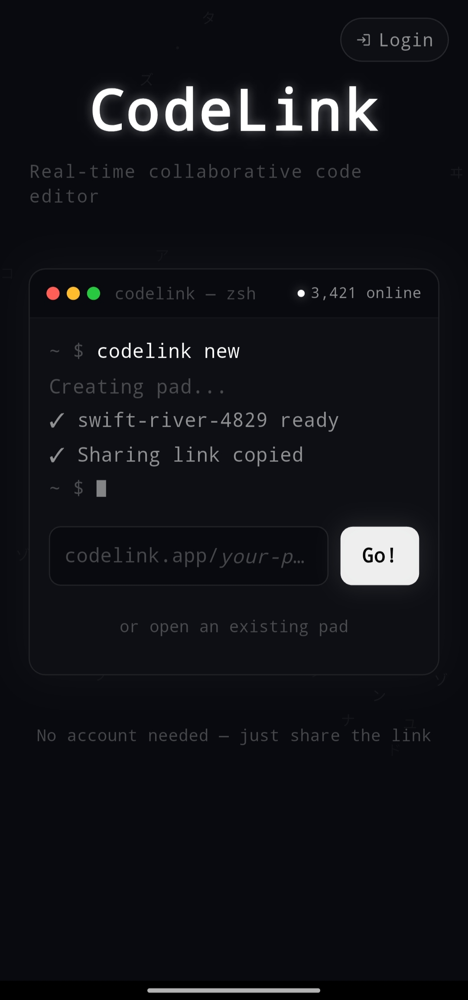
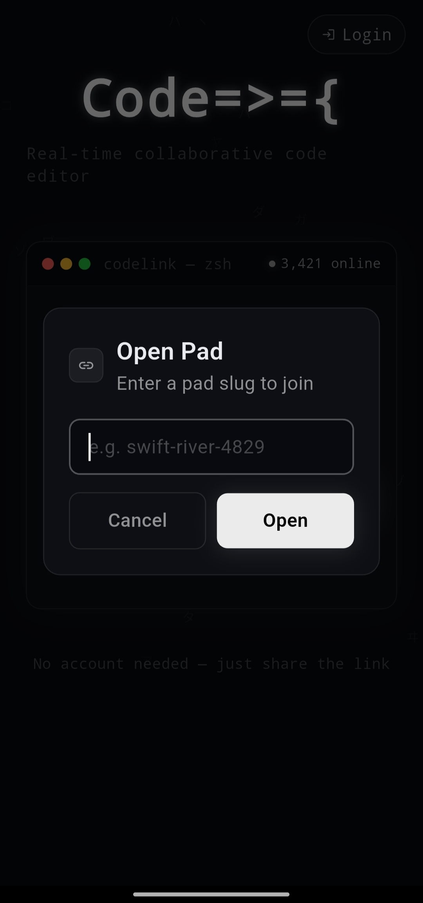
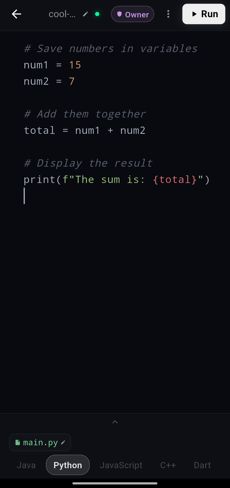
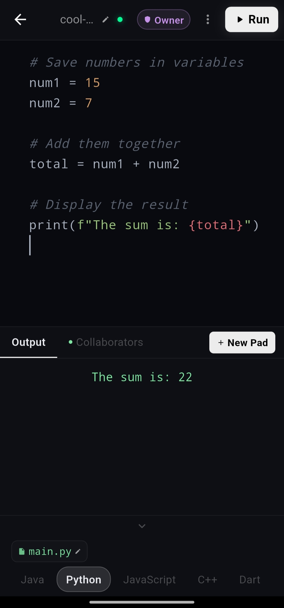
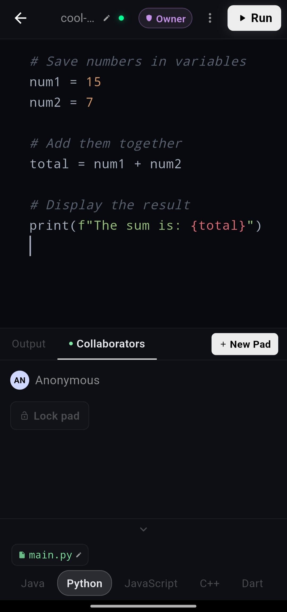
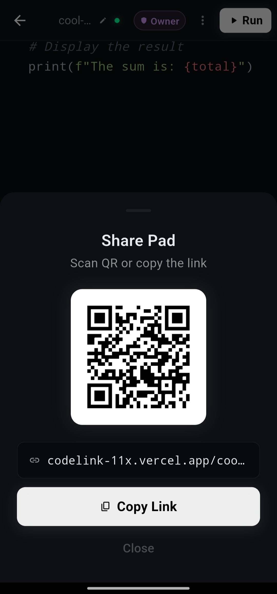
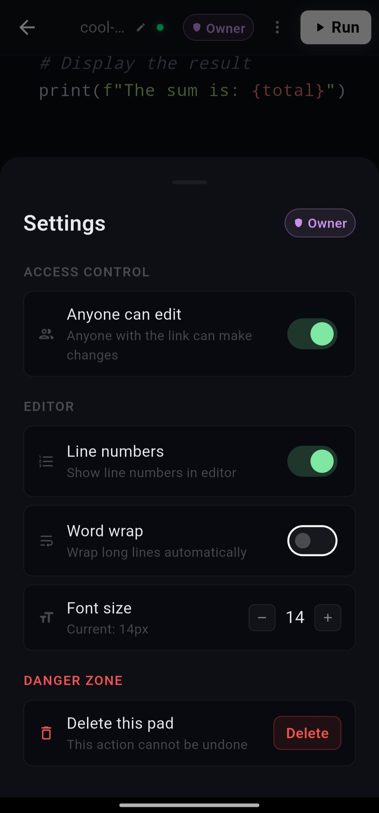
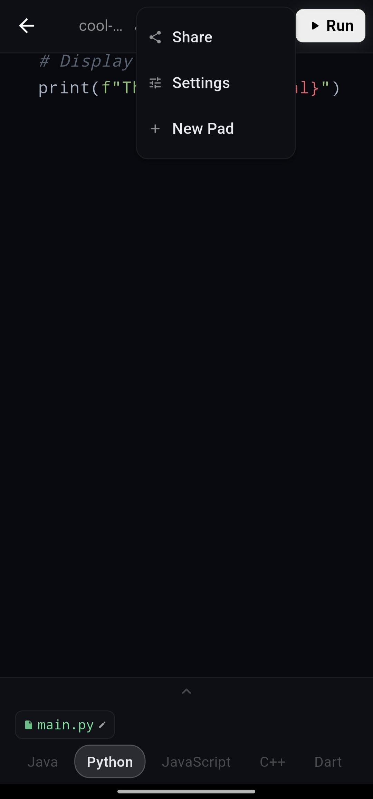

# 🚀 CodeLink

A real-time collaborative code editor built with Flutter Web. Create a coding session, share the link, and code together instantly.

🌐 **Live Demo:** https://codelink-11x.vercel.app

---

## 📱 Preview

| Login | Join Session |
|-------|--------------|
|  |  |

| Code Editor | Output |
|------------|--------|
|  |  |

| Collaborators | Share Pad |
|---------------|-----------|
|  |  |

| Settings | Menu |
|----------|------|
|  |  |

---

## ✨ Features

- 🚀 Real-time collaboration with Socket.io
- 💻 Multi-language code execution
  - Python
  - JavaScript
  - Java
  - C++
  - Dart
- 🔗 Share sessions via link or QR code
- 🎨 Syntax highlighting with line numbers
- 📤 Resizable output panel
- 👥 Owner, Editor & Viewer roles
- ⚡ Live code synchronization
- 🌙 Modern dark UI

---

## 🛠 Tech Stack

| Category | Technology |
|----------|------------|
| Frontend | Flutter Web |
| Backend | Node.js, Express.js |
| Realtime | Socket.io |
| Database | PostgreSQL |
| Code Execution | OneCompiler API |
| Deployment | Vercel & Railway |

---

## 🚀 Run Locally

### Backend

```bash
cd backend
npm install
npm run dev
```

### Frontend

```bash
flutter pub get
flutter run -d chrome
```

---

## 🔑 Environment Variables

```env
PORT=3000
DATABASE_URL=your_postgresql_url
JWT_SECRET=your_secret
RAPID_API_KEY=your_rapidapi_key
REDIS_URL=redis://localhost:6379
```

---

## 📄 License

MIT
